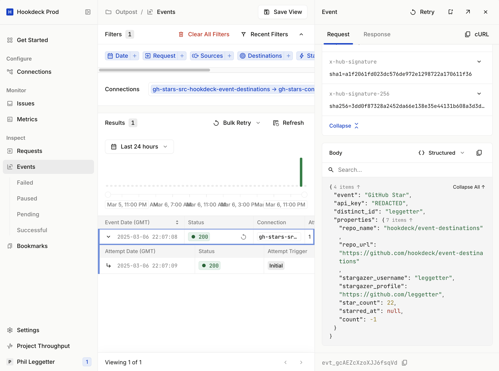
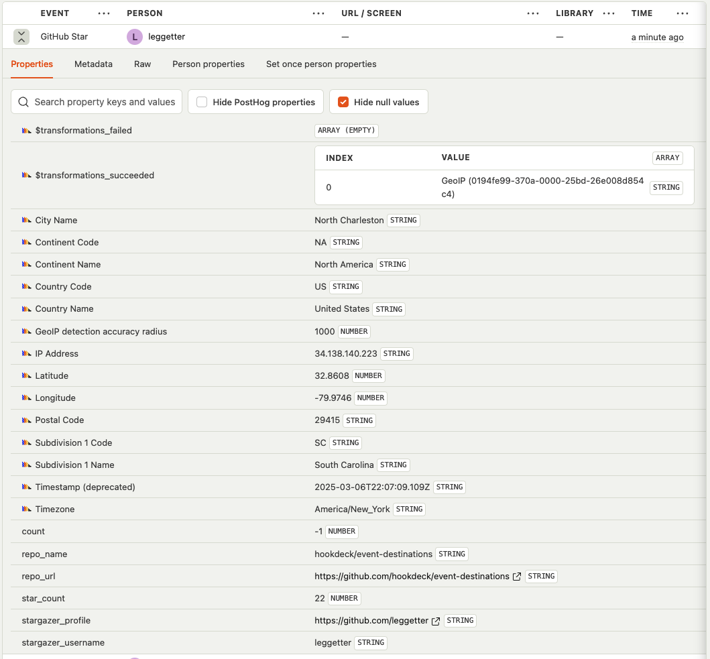

# GitHub Stars to PostHog via Hookdeck

A TypeScript application that sets up [GitHub stars webhooks](https://docs.github.com/en/webhooks/webhook-events-and-payloads#star) and sends them via [Hookdeck](https://hookdeck.com?ref=github-github-stars-to-posthog). Hookdeck transforms the webhook payload into a [PostHog](https://posthog.com) capture event payload and sends the data to the PostHog API.

## Requirements

- Node.js >= 20.6.0 (for native TypeScript support)

## Setup

1. Clone this repository
2. Install dependencies:
   ```
   npm install
   ```
3. Create a `.env` file based on the `.env.example` template and fill in your credentials:
   - `GITHUB_TOKEN`: Your GitHub personal access token
   - `GITHUB_WEBHOOK_SECRET`: A secret key for GitHub webhook security
   - `POSTHOG_HOST`: Your PostHog API host. For the US this is https://us.i.posthog.com
   - `POSTHOG_API_KEY`: Your PostHog API key
   - `HOOKDECK_API_KEY`: Your Hookdeck API key
   - `REPO_OWNER`: Owner of the repository to track
   - `REPO_NAME`: Name of the repository to track

## Usage

Run the application directly with Node.js native TypeScript support:

```
npm run start
```

## Screenshots

### Event in Hookdeck



### Event in PostHog



## License

MIT
